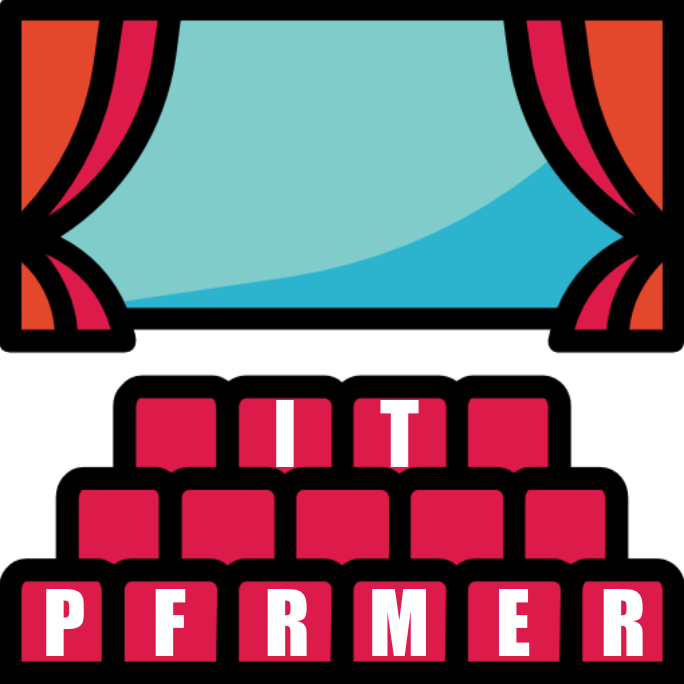

38세.. 30대 후반의 늦은 나이에 개발자로 전직을 했고,  
2년만에 이렇게 기술 관련하여 블로그를 적게 되나니 감개무량하다.

그렇다고 해박한 지식과 유려한 문체를 구사하는 다른 개발자분들 처럼 글을 쓸 자신도 실력도 없다. 그저... 개발자로 생활하며 얻게되는 지식들을 정리하는 소소한 공간을 만들어가려 한다.

## IT퍼포머?

IT + Performer  
블로그 이름을 무엇으로 할까 고민하다가.. 개발자로 전직하면서 그 개념들이 너무 생소해 내가 익숙한 것들에 대입하여 이해할 때가 많았던게 생각이 났다.  
그 중에서도 공연기획가로 활동한 경험때문인지 공연에 대입해서 기억할 때 특히 효율이 좋았다.  
모든 글에 공연을 예시로 들진 않겠지만 그래도 많은 부분을 차지 할 것 같아 블로그 이름을 IT와 공연이 결합된 **IT퍼포머**로 지어봤다.

## 당분간의 방향성

앞서 이야기 했듯이 아직 한 기술에 대해 연재를 한다거나 할 실력도 여건도 되지 않는다고 생각한다. 그저 내가 경험한 개발과 관련한 기록들을 짧게 짧게나마 남기고 싶다. 난 천재가 아닌 범인이기에 메모하며 정리하고 생각이 안날 때 확인할 곳이 필요하다.  
**소 뒷걸음치다 쥐 잡는격**으로 나처럼 개발용어와 세계관이 익숙치 않으신 분들에게 조금이나마 도움이 된다면 더할나위 없는 기쁨이 될 것 같다.
